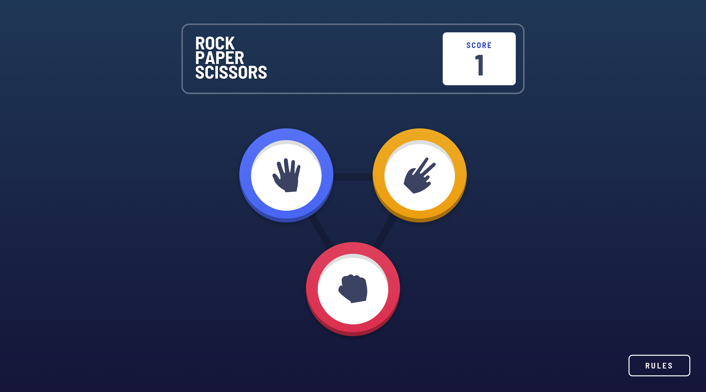

# Frontend Mentor - IP address tracker solution

This is a solution to the [Rock, Paper, Scissors challenge on Frontend Mentor](https://www.frontendmentor.io/challenges/rock-paper-scissors-game-pTgwgvgH). Frontend Mentor challenges help you improve your coding skills by building realistic projects. 

## Table of contents

- [Overview](#overview)
  - [The challenge](#the-challenge)
  - [Screenshot](#screenshot)
  - [Links](#links)
- [My process](#my-process)
  - [Built with](#built-with)
  - [Continued development](#continued-development)
- [Author](#author)

## Overview

### The challenge

Users should be able to:

- View the optimal layout for the game depending on their device's screen size
- Play Rock, Paper, Scissors against the computer
- Maintain the state of the score after refreshing the browser _(optional)_
- **Bonus**: Play Rock, Paper, Scissors, Lizard, Spock against the computer _(optional)_

### Screenshot

### Links

- Solution URL: [GitHub Repo](https://github.com/waldosmuts/ip-address-tracker)
- Live Site URL: [Live Preview](https://crowdfund-mastercraft.netlify.app/)

## My process

### Built with

- Semantic HTML5 markup
- Flexbox
- CSS Grid
- Mobile-first workflow
- [React](https://reactjs.org/) - JS Library
- [Tailwind](https://tailwindcss.com/) - CSS Framework
- [Ipify](https://www.ipify.org/) - IP Address API
- [Mapbox](https://www.mapbox.com/) - Map API

### Continued development

I want to continue build apps with React, big and small to get the needed experience.

## Author

- Portfolio - [Waldo Smuts](https://waldosmuts.netlify.app)
- Frontend Mentor - [@waldosmuts](https://www.frontendmentor.io/profile/waldosmuts)
